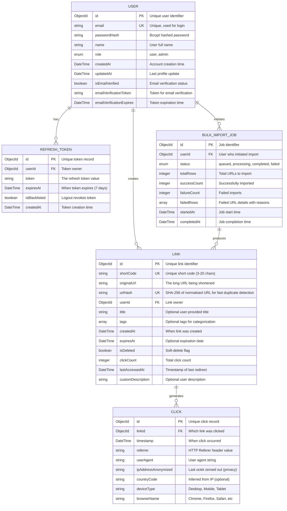

# ER Diagram: Data Model

## Key Design Decisions

**Link Model:**
- `shortCode` is unique and indexed for fast lookups during redirect
- `userId` + `shortCode` composite index for user-specific queries
- `expiresAt` indexed for efficient expiration checks
- `isDeleted` flag enables soft-delete without losing analytics history
- `clickCount` denormalized for performance (alternative: count clicks from CLICK table)

**Click Model:**
- Separate collection for click analytics (scales independently)
- `ipAddressAnonymized` removes last octet (192.168.1.42 → 192.168.1.0)
- `timestamp` indexed for time-range queries
- Designed for eventual consistency (updates lag by seconds)

**Indexes Required:**
- Link: unique(shortCode), unique(urlHash + userId) for per-user duplicate detection, index(userId), index(expiresAt), index(isDeleted)
- Click: index(linkId, timestamp), index(timestamp)
- User: unique(email)
- RefreshToken: index(userId, expiresAt)
