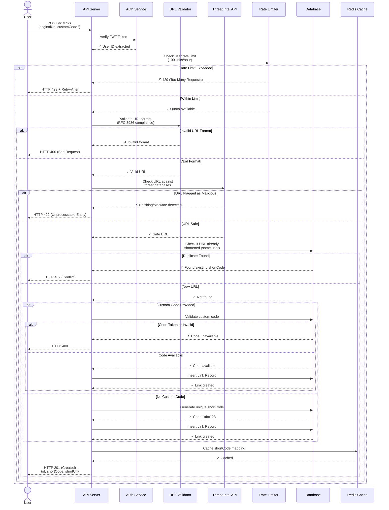
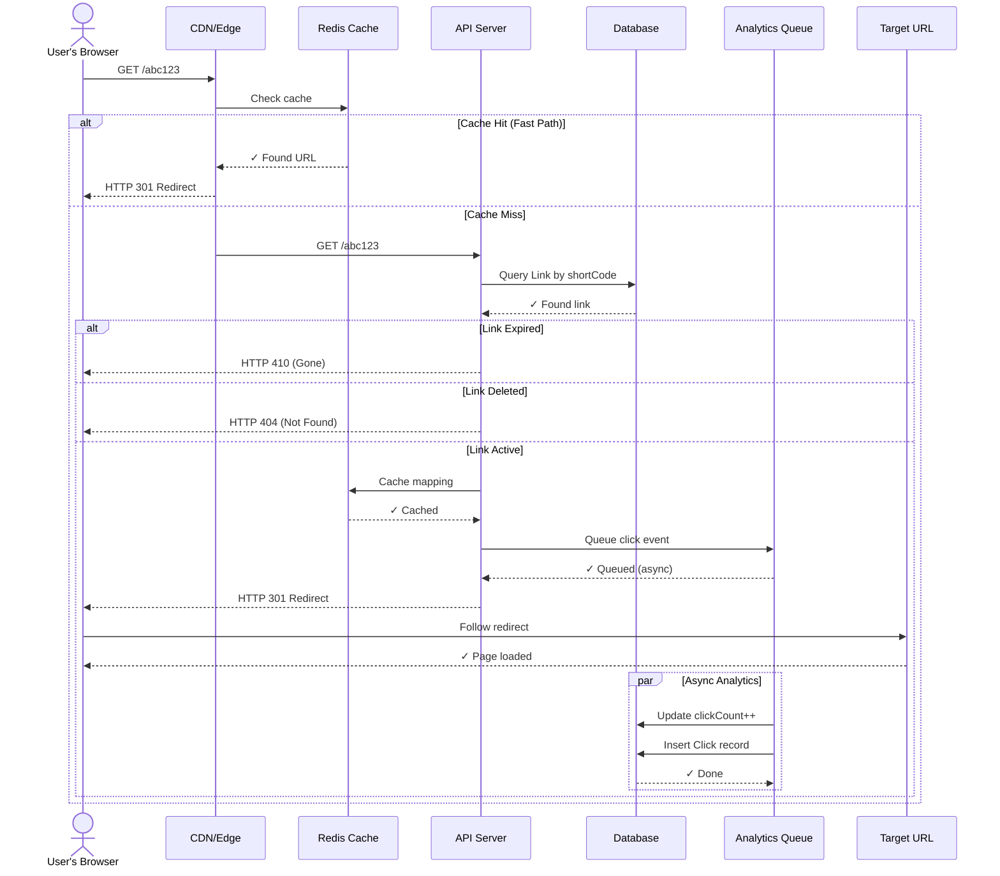

# Sequence Diagram: URL Shortening Request Flow

## POST /v1/links - Create Shortened URL

```mermaid
sequenceDiagram
    actor User
    participant API as API Server
    participant Auth as Auth Service
    participant Validator as URL Validator
    participant ThreatAPI as Threat Intel API
    participant RateLimit as Rate Limiter
    participant DB as Database
    participant Cache as Redis Cache

    User->>API: POST /v1/links<br/>{originalUrl, customCode?}
    
    API->>Auth: Verify JWT Token
    Auth-->>API: ✓ User ID extracted
    
    API->>RateLimit: Check user rate limit<br/>(100 links/hour)
    alt Rate Limit Exceeded
        RateLimit-->>API: ✗ 429 (Too Many Requests)
        API-->>User: HTTP 429 + Retry-After
    else Within Limit
        RateLimit-->>API: ✓ Quota available
        
        API->>Validator: Validate URL format<br/>(RFC 3986 compliance)
        alt Invalid URL Format
            Validator-->>API: ✗ Invalid format
            API-->>User: HTTP 400 (Bad Request)
        else Valid Format
            Validator-->>API: ✓ Valid URL
            
            API->>ThreatAPI: Check URL against<br/>threat databases
            alt URL Flagged as Malicious
                ThreatAPI-->>API: ✗ Phishing/Malware detected
                API-->>User: HTTP 422 (Unprocessable Entity)
            else URL Safe
                ThreatAPI-->>API: ✓ Safe URL
                
                API->>DB: Check if URL already<br/>shortened (same user)
                alt Duplicate Found
                    DB-->>API: ✓ Found existing shortCode
                    API-->>User: HTTP 409 (Conflict)
                else New URL
                    DB-->>API: ✓ Not found
                    
                    alt Custom Code Provided
                        API->>DB: Validate custom code
                        alt Code Taken or Invalid
                            DB-->>API: ✗ Code unavailable
                            API-->>User: HTTP 400
                        else Code Available
                            DB-->>API: ✓ Code available
                            API->>DB: Insert Link Record
                            DB-->>API: ✓ Link created
                        end
                    else No Custom Code
                        API->>DB: Generate unique shortCode
                        DB-->>API: ✓ Code: 'abc123'
                        API->>DB: Insert Link Record
                        DB-->>API: ✓ Link created
                    end
                    
                    API->>Cache: Cache shortCode mapping
                    Cache-->>API: ✓ Cached
                    
                    API-->>User: HTTP 201 (Created)<br/>{id, shortCode, shortUrl}
                end
            end
        end
    end
```

## GET /:shortCode - Redirect Flow

```mermaid
sequenceDiagram
    actor Browser as User's Browser
    participant CDN as CDN/Edge
    participant Cache as Redis Cache
    participant API as API Server
    participant DB as Database
    participant Analytics as Analytics Queue
    participant Target as Target URL

    Browser->>CDN: GET /abc123

    CDN->>Cache: Check cache
    alt Cache Hit (Fast Path)
        Cache-->>CDN: ✓ Found URL
        CDN-->>Browser: HTTP 301 Redirect
    else Cache Miss
        CDN->>API: GET /abc123
        
        API->>DB: Query Link by shortCode
        DB-->>API: ✓ Found link
        
        alt Link Expired
            API-->>Browser: HTTP 410 (Gone)
        else Link Deleted
            API-->>Browser: HTTP 404 (Not Found)
        else Link Active
            API->>Cache: Cache mapping
            Cache-->>API: ✓ Cached
            
            API->>Analytics: Queue click event
            Analytics-->>API: ✓ Queued (async)
            
            API-->>Browser: HTTP 301 Redirect
            
            Browser->>Target: Follow redirect
            Target-->>Browser: ✓ Page loaded
            
            par Async Analytics
                Analytics->>DB: Update clickCount++
                Analytics->>DB: Insert Click record
                DB-->>Analytics: ✓ Done
            end
        end
    end
```
