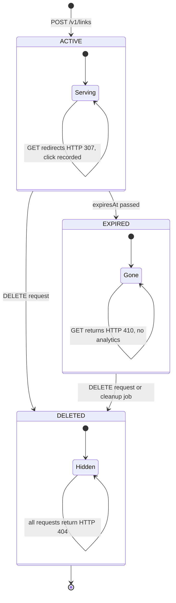

# State Diagram: Link Lifecycle

## State Transitions & Business Rules




### ACTIVE State
**Entry Conditions:**
- User successfully creates link (POST /v1/links returns 201)
- URL is valid (RFC 3986 compliant)
- URL is safe (not malicious)
- Short code is unique

**What can happen in ACTIVE:**
- ✓ User accesses link → generates click record → updates lastAccessedAt
- ✓ User calls PATCH to update metadata (title, tags, description, expiresAt)
- ✓ User retrieves analytics (GET /v1/links/:code/analytics)
- ✓ Automatic transition to EXPIRED if expiresAt time passes
- ✓ User deletes link → transition to DELETED

**HTTP Behaviors in ACTIVE:**
- GET /r/:shortCode → HTTP 307 with Location header (redirect)
- GET /v1/links/:shortCode → HTTP 200 (link details)
- PATCH /v1/links/:shortCode → HTTP 200 (update)
- DELETE /v1/links/:shortCode → HTTP 204 (delete)

---

### EXPIRED State
**Entry Conditions:**
- Current time > link.expiresAt
- Can be automatic or checked on each access

**What can happen in EXPIRED:**
- × User cannot update metadata
- × Analytics are NOT recorded (save resources)
- ✓ User can still delete the link manually
- ✓ System can auto-cleanup after configured grace period (e.g., 90 days)

**HTTP Behaviors in EXPIRED:**
- GET /:shortCode → HTTP 410 Gone (no redirect)
- GET /v1/links/:shortCode → HTTP 410 Gone
- PATCH /v1/links/:shortCode → HTTP 410 Gone
- DELETE /v1/links/:shortCode → HTTP 204 (soft-delete)

---

### DELETED State
**Entry Conditions:**
- User explicitly calls DELETE
- Link moves from ACTIVE or EXPIRED to DELETED (soft-delete)
- Record remains in database with isDeleted=true

**What can happen in DELETED:**
- × No API operations allowed (all return 404)
- × Link inaccessible to users
- ✓ Analytics history preserved (reportable)
- ✓ Can be permanently purged after 90-day retention (if compliance requires)

**HTTP Behaviors in DELETED:**
- GET /:shortCode → HTTP 404 Not Found
- GET /v1/links/:shortCode → HTTP 404 Not Found
- PATCH /v1/links/:shortCode → HTTP 404 Not Found
- DELETE /v1/links/:shortCode → HTTP 404 Not Found (idempotent)

---

## Timeline Example

```
Timeline: Link created with expiresAt = 2025-06-30

[2024-04-18 10:00] User creates link
                   State: ACTIVE
                   HTTP 201 created

[2024-04-18 10:05] User accesses link
                   State: ACTIVE
                   HTTP 307 redirect + click recorded

[2024-06-29 23:59] User accesses link (1 day before expiry)
                   State: ACTIVE
                   HTTP 307 redirect + click recorded

[2024-06-30 00:00] Link expires (automatic)
                   State: ACTIVE → EXPIRED (triggered on next access)

[2024-06-30 12:00] User tries to access expired link
                   State: EXPIRED
                   HTTP 410 Gone + no analytics

[2024-07-15 14:30] User calls DELETE
                   State: EXPIRED → DELETED
                   HTTP 204 No Content

[2024-10-15 00:00] Auto-cleanup (after 90-day retention)
                   Permanently delete from DB (optional)
```

## Database Queries by State

```sql
-- Find all ACTIVE links for a user
SELECT * FROM Link WHERE userId=123 AND isDeleted=false AND expiresAt > NOW()

-- Find EXPIRED links (for cleanup job)
SELECT * FROM Link WHERE isDeleted=false AND expiresAt < NOW()

-- Find DELETED links (for audit)
SELECT * FROM Link WHERE isDeleted=true

-- Check if link is accessible
SELECT * FROM Link WHERE shortCode='abc123' AND isDeleted=false AND (expiresAt IS NULL OR expiresAt > NOW())
```

